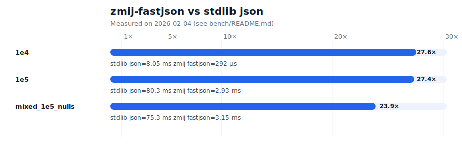

# zmij-fastjson

Python packages (CPython C extensions) for fast, stdlib-compatible JSON serialization of numeric arrays,
powered by the Żmij (vitaut/zmij) float-to-string algorithm (binary floating-point → shortest correctly-rounded decimal string).

## Repository Structure

```
zmij-fastjson/
├── pyzmij/         # Python binding for vitaut/zmij
├── fastjson/       # High-level fast JSON serializer
├── bench/          # Benchmarks (pyperf-based)
└── tools/          # Utility scripts
```

## What’s Here

- **`pyzmij`**: Python C-extension exposing fast finite `float` formatting.
- **`fastjson`**: Drop-in replacement for the standard library `json` module, with native fast paths for large
  `list[float]` / `tuple[float]` (and some float-heavy sequences).
  - Contract: `fastjson.dumps()` is byte-for-byte identical to `json.dumps()` for all inputs and options,
    including matching exception type and message.
  - Performance: when the input and options are supported by the native fast paths (e.g. float sequences with
    stdlib-default or compact separators), `fastjson` bypasses stdlib and formats directly in C.
  - `separators=` may be any length-2 string sequence (tuple/list). Unsupported separators fall back to stdlib.


If your workload is “big numeric arrays → JSON”, this repo is designed to help.

## Development Setup (uv)

### Setup

```bash
# Create virtual environment
uv venv

# Activate (Linux/macOS)
source .venv/bin/activate

# Activate (Windows PowerShell)
.venv\Scripts\Activate.ps1

# Install packages in editable mode
uv pip install -e ./pyzmij[dev]
uv pip install -e ./fastjson[dev]
```

### Testing

```bash
export UV_CACHE_DIR=/tmp/uv-cache  # optional (useful on locked-down environments)

# Run package tests (run separately to avoid test module name collisions)
uv run -m pytest -q pyzmij/tests/ --ignore=pyzmij/tests/test_repr_compat.py
uv run -m pytest -q fastjson/tests/

# (Optional) Enable heavy repr() compatibility test
PYZMIJ_RUN_REPR_COMPAT=1 uv run -m pytest -q pyzmij/tests/test_repr_compat.py
```

### Benchmarking

```bash
# Float formatting benchmark
uv run python bench/pyperf_float.py -o bench/results/float.json

# JSON serialization benchmark (fastjson vs stdlib json)
uv run python bench/pyperf_json.py -o bench/results/json.json

# Macro benchmark (complex nested structures)
uv run python bench/pyperf_macro.py -o bench/results/macro.json

# View results
uv run python -m pyperf show bench/results/json.json
```

#### Performance expectations

`fastjson` is optimized for large `list/tuple` sequences that are mostly numeric (especially `float`),
optionally with occasional `null` (`None`). On such inputs it can be ~20–30x faster than stdlib `json`
when producing compact JSON (`separators=(',', ':')`) in our local benchmarks.

On generic JSON (top-level `dict`, deeply nested mixed types), `fastjson` usually falls back to stdlib
and performance is expected to be similar.



Bench labels in the chart:
- **`1e4`**: random finite `float` list with **10,000** elements (`datasets.random_finite_f64_values(10_000, ...)`)
- **`1e5`**: random finite `float` list with **100,000** elements (`datasets.random_finite_f64_values(100_000, ...)`)
- **`mixed_1e5_nulls`**: mostly floats (100,000 total), with `None` → `null` inserted periodically (currently every 20 items)
  (`datasets.mostly_floats_with_nulls(100_000, null_every=20, ...)`)

## Implementation

- **pyzmij**: Python C extension using vitaut/zmij
  - `format_finite()`: Fast float-to-string conversion
  - `bench_format_many()`: Batch formatting for benchmarks
  - Backend: vendored vitaut/zmij (see `pyzmij/third_party/` and `pyzmij/VENDORED.md`)

- **fastjson**: High-performance JSON serializer
  - Fast path: `list[float]` / `tuple[float]` using C directly
  - Slow path: Fallback to stdlib `json.dumps()` for other types
  - NaN/Inf handling with `allow_nan` parameter

- **Benchmarks**: pyperf-based comparison suite

## TODO

- [ ] Add comprehensive test vectors for edge cases (subnormals, max/min values)
- [ ] Add fuzzing tests for robustness
- [ ] Benchmark vs other JSON serializers (e.g. orjson, ujson) on numeric-array workloads
